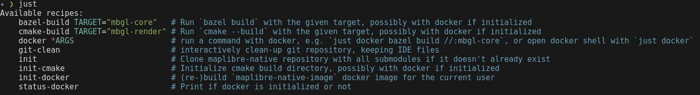

Helper utilities to develop [MapLibre Native](https://github.com/maplibre/maplibre-native) code.

This justfile should be living in the MapLibre Native repo, but the maintainers feel a [bit uncertain](https://github.com/maplibre/maplibre-native/pull/2653) about it for now, so keeping it separate. 

* Clone this repo
* Install [just](https://github.com/casey/just#readme), a modern alternative to `make`.
* Run `just init` to clone the MapLibre Native repo and set up the submodules.
* Run `just` to see the list of available commands.
* To use Docker, run `just init-docker` to initialize the Docker container. All subsequent cmake and bazel commands will use docker.
